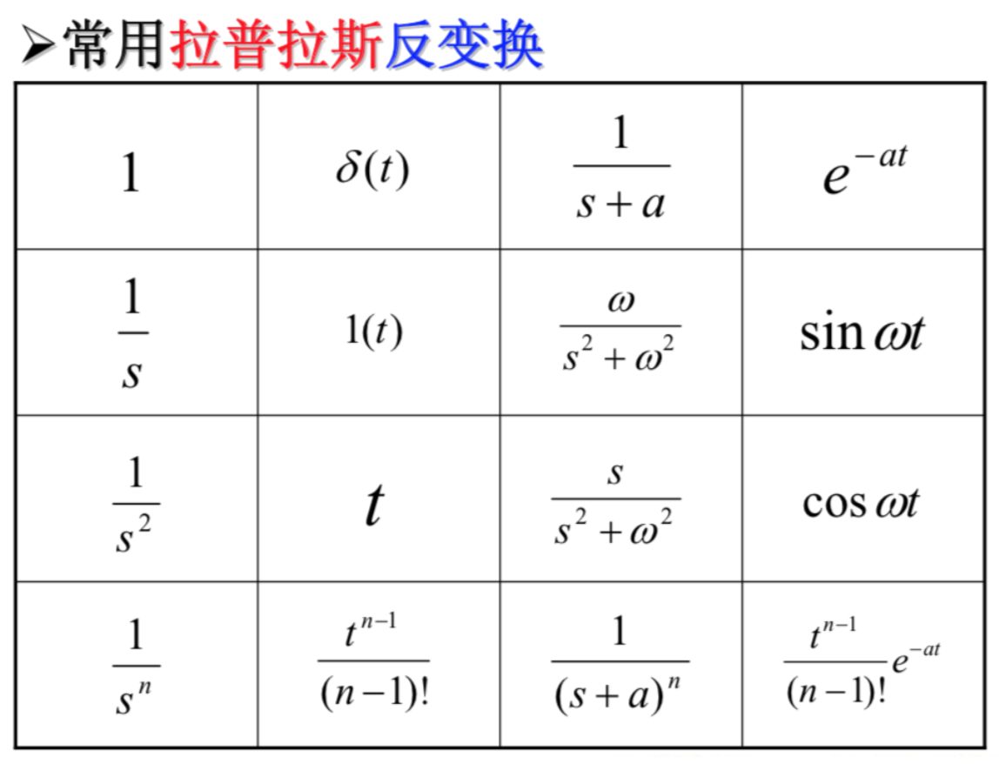
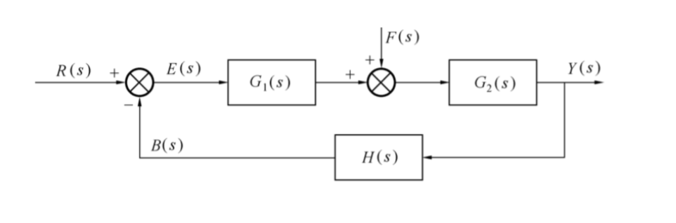
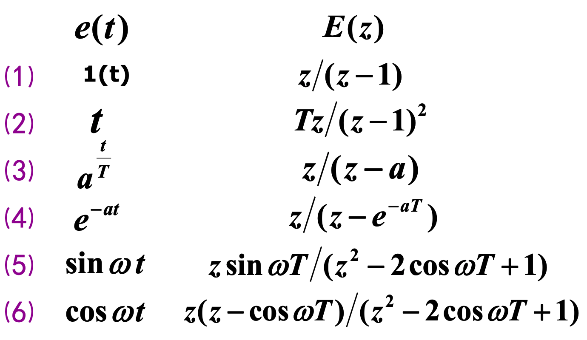
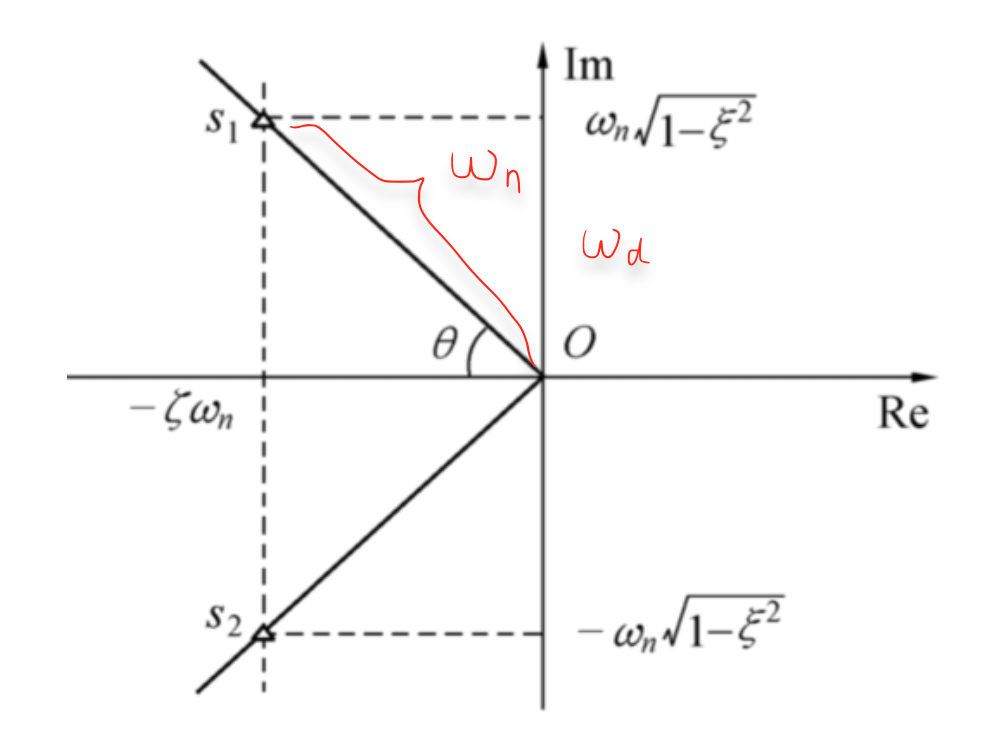
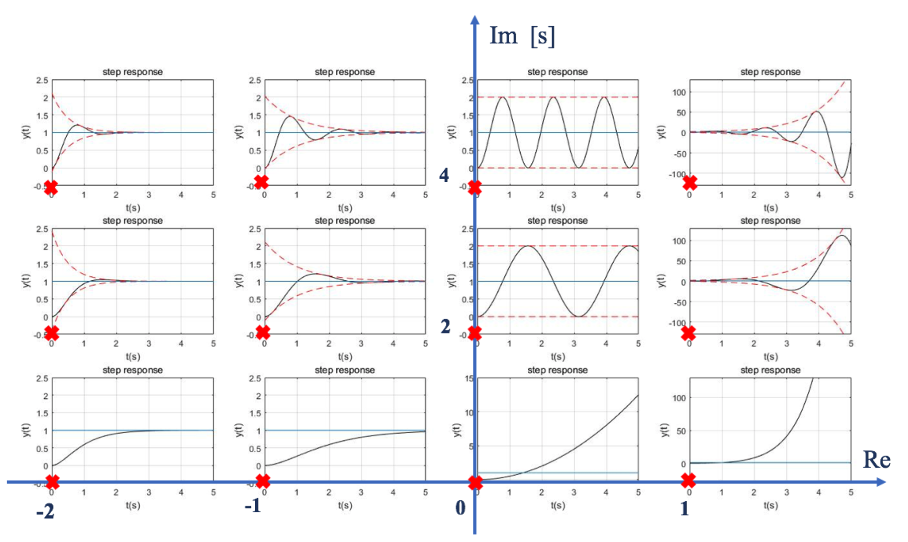

# 自控理论A

[TOC]

---

## 绪论

### 历史与发展

1.  经典（1931~1959）
2.  现代（1960~1970）
3.  大系统、智能控制（1971~now）

### 基本原理与方式

#### 开环

-   结构简单、价格低廉
-   不具备自动纠正被控量误差的能力
-   干扰和元件性能改变使得控制精度降低

#### 闭环

##### 系统组成

-   被控对象
-   执行元件
-   放大元件
-   测量元件
-   比较元件
-   校正元件

##### 信号

-   输入信号 $r(t)$ 
-   输出信号 $y(t)$ 
-   反馈信号 $b(t)$ 
-   偏差信号 $\varepsilon(t)$ 
-   误差信号 $e(t)$ 
-   干扰信号 $f(t)$ 
-   其他信号 

### 分类

-   线性 否？
-   定常(参数非时变) 否？
-   连续 否？
-   规律？
    -   程序
    -   随动
    -   恒值

### 控制系统基本要求

#### 稳定性

-   先决条件
-   振荡？发散？

#### 快速性

-   动态过程长短

#### 准确性

-   误差小

#### 平稳性

-   过枉矫正
-   大幅摆动

### 主要内容

1.  数学模型描述
2.  时域分析
3.  稳定性分析
4.  频域分析

---

## 控制系统 的 数学模型

-   时域：常微分方程
-   复频域：传递函数
-   方框图
-   信号流图
-   状态空间模型
-   离散系统：脉冲传递函数

---

### 基本概念

#### 定义

-   描述各变量间关系的数学、图形或数字表达式

-   同一物理系统 可以由 不同的模型描述
-   不同物理系统 可以由 相同的模型描述

#### 建模方法

1.  机理分析——白箱
2.  测试法——黑箱
    -   实验法、经验法
3.  综合法——灰箱
    -   系统辨识与参数估计

#### 种类

1.  经典控制：微分、差分、瞬态响应函数、传递函数、频率特性
2.  现代控制：状态空间表达式、状态方程

---

### 微分方程的建立——时域

#### SISO

-   步骤：
    1.  分析：确定输入输出
    2.  列写：按基本定律列方程组，注意**负载效应**
    3.  化简：消去中间变量，使方程只含输入输出及其各阶导数  
    4.  整理：输出放左边，输入放右边，各按导数降阶排列  

#### 机械系统

| 基本要素 |                         运动方程                         |
| :------: | :------------------------------------------------------: |
| 质量要素 |         $F=m\dfrac{\mathrm d^2x}{\mathrm dt^2}$          |
| 弹性要素 |           $F = kx = k\int_0^t v \ \mathrm dt$            |
| 阻尼要素 |                      $F=fv=f\dot x$                      |
| 惯性要素 | $T = J\alpha = J\dfrac{\mathrm d^2\theta}{\mathrm dt^2}$ |

-   摩擦力
    $$
    F_c = F_B + F_f = f\frac{\mathrm dx}{\mathrm dt}+F_f
    $$

-   摩擦力矩
    $$
    T_c = T_B + T_f = K_c\frac{\mathrm d\theta}{\mathrm dt} + T_f 
    $$
    

---

### 传递函数——复频域

#### 拉普拉斯变换

-   $F(s)= L[f(t)] = \displaystyle\int_0^\infty f(t)e^{-st} \mathbb dt $  

-     

-   性质

    1.  线性：$L[af_1(t)+bf_2(t)]=aL[f_1(t)]+bL[f_2(t)] $  

    2.  微分：

        -   $L[\dfrac{df(t)}{dt}]=sF(s)-f(0)$  

        -   推论：
			
          若$f(0)=f’(0)=\cdots=f^{(n-1)}(0) = 0$，则
          $$
          L[\dfrac{d^nf(t)}{dt^n}]=s^nF(s)\\
          $$
          
    
    3.  积分定理
    4.  初值定理：$f(0^+)=\lim\limits_{s\rightarrow\infty}\ sF(s)$  
    5.  终值定理：$\lim\limits_{t\rightarrow\infty}\ f(t) = \lim\limits_{s\rightarrow0}\ sF(s)$
    6.  ==位移定理==：$\mathscr{L}[e^{at}f(t)]=F(s-a)$  
    7.  ==相似定理==:  $\mathscr{L}[f\left(\dfrac{t}{a}\right)]=aF(as)$  
    8.  卷积定理

#### 传递函数及其表达形式

-   线性定常系统传递函数定义：
    -   **零初始条件下**，系统输出量的Laplace变换与输入量的Laplace变换之比。
    -   $G(s)=\dfrac{Y(s)}{R(s)}=\dfrac{b_ns^n+b_{n-1}s^{n-1}+\cdots+b_1s+b_0}{s^n+a_{n-1}s^{n-1}+\cdots+a_1s+a_0} $  

-   ***Remarks***: 
    1.  传递函数与微分方程一一对应
    2.  参数仅取决于系统本身
    3.  与输入输出信号（的作用/取出）位置相关
    4.  系数$a, b\in \mathbb{R}$，零点、极点是实数或共轭复数
    5.  分母阶次n $\geq$ 分子阶次m（因果系统）
    6.  不反映真实物理结构
    7.  令分母=0，可得系统的<u>**特征方程**</u> 
    8.  $G(s)$==的Laplace反变换是脉冲响应==$g(t$)：$g(t)=\mathscr L^{-1}[G(s)\cdot \mathscr L[\delta(t)]]=\mathscr L^{-1}[G(s)\cdot 1]$  

##### 1. 根轨迹

-   零点与极点
-   $G(s)=\dfrac{b_0(s-z_1)(s-z_2)\cdots(s-z_m)}{a_0(s-p_1)(s-p_2)\cdots(s-p_n)}=K^*\dfrac{\prod\limits_{i=1}^m(s-z_i)}{\prod\limits_{j=1}^n(s-p_j)}$  
-   传递系数 / 根轨迹增益：$K^* = \dfrac{b_0}{a_0}$  

##### 2. 频率法表达

-   $G(s)=\dfrac{b_m(\tau_1s+1)(\tau_2^2s^2+2\zeta\tau_2s+1)\cdots(\tau_is+1)}{a_m(T_1s+1)(T_2^2s^2+2\zeta T_2s+1)\cdots(T_js+1)}$  
-   一次项对应实数零、极点，二次项对应共轭复数零、极点  
-   $T,\ \tau$ 为时间常数  
-   关系：==开环增益== $K=\dfrac{b_m}{a_m}=K^*\dfrac{\prod\limits_{i=1}^m(-z_i)}{\prod\limits_{j=1}^n(-p_j)}$  （令$s=0$）

#### 系统基本环节及其传递函数

##### 1. 放大环节（比例环节）

-   $y(t)=Kr(t)$
-   $G(s)=\dfrac{Y(s)}{R(s)}=K$  

##### 2. 惯性环节

-   $T\dfrac{\mathbb dy(t)}{\mathbb dt}+y(t)=r(t)$  
-   $G(s)=\dfrac{1}{Ts+1}$  
-   $T$：惯性环节的==时间常数==；$T=0$ 时该环节变成比例环节。  

##### 3. 积分环节

-   $y(t) = \int r(t) \mathbb d t$  
-   $G(s) = \dfrac{Y(s)}{R(s)}=\dfrac{1}{s}$  

##### 4. 振荡环节

##### 5. 纯微分

##### 6. 一阶微分

##### 7. 二阶微分

##### 8. 延迟环节

---

### 方框图

#### 概念

1.  信号线
    -   信号、流向
2.  函数方框
    -   传递函数（单向运算算子）
3.  相加点
    -   加减、代数和
4.  分支点
    -   同一位置数值性质相同

-   ***Remarks***: 
    -   同一系统的方框图可以不同

#### 绘图步骤

1.  ==零初始条件==下**<u>各环节</u>**的传递函数
2.  画各环节的函数方框
3.  按**<u>信号传输方向</u>**连接函数方框

#### 变换规则

-   基本原则：==等效原则==——数学关系（传递函数）不改变

1.  串联

    -   $G(s)= \prod\limits_{k=1}^n (\pm)G_k(s)$  
    -   SISO！

2.  并联

    -   $G(s)= \sum\limits_{k=1}^n (\pm)G_k(s)$  

3.  单回路反馈

    -   设

        -   反馈表达式：$\varepsilon(s)= R(s)\boldsymbol\pm B(s)$ 

        -   前向通道传函$G(s)$

        -   反馈通道传函$H(s)$

            （开环传函$G(s)H(s)$） 

        -   闭环传函$\varPhi(s)$ 

        则

    $$
    \varPhi(s) = \dfrac{G(s)}{1\boldsymbol{\mp} G(s)H(s)}
    $$

4.  相加点与分支点的移动

    -   前：逆信号流向；后：信号流向
    
    1.  相加点：前除后乘
    2.  分支点：前乘后除
    3.  变 单位反馈：
    
    -   ***Remarks***: 
        -   分支点尽量不要移动到相加点上，因为两者不能直接交换顺序，反之亦然

-   化简的一般步骤
    1.  确定输入输出：多输入可应用叠加原理（线性系统）
    2.  消除交叉
    3.  多（嵌套）回路：由内向外处理

#### 几个系统传递函数

1.  开环
  
    -   $\dfrac{B(s)}{\varepsilon(s)}=G(s)H(s)$  
    
2.  输出对==参考输入==的闭环
  
    -   $\varPhi(s)=\dfrac{Y(s)}{R(s)}=\dfrac{G_1(s)G_2(s)}{1+G_1(s)G_2(s)H(s)}$  
    
3.  输出对==扰动输入==的闭环
  
    -   $\varPhi_F(s)=\dfrac{Y(s)}{F(s)}=\dfrac{G_2(s)}{1+G_1(s)G_2(s)H(s)}$  
    
4.  系统总输出：叠加原理
  
    -   $Y(s)=\varPhi(s)R(s)+\varPhi_F(s)F(s)$
    
5.  **<u>偏差信号</u>**对参考输入的闭环
    $$
    \begin{aligned}
    \varPhi_\varepsilon(s)&=\dfrac{\varepsilon(s)}{R(s)}\\
    &=\dfrac{R(s)-Y(s)H(s)}{R(s)}\\
    &=1-H(s)\dfrac{Y(s)}{R(s)}\\
    &=\boldsymbol{1-H(s)\varPhi(s)}\\
    &=\dfrac{1}{1+G_1(s)G_2(s)H(s)}
    \end{aligned}
    $$
    
6.  <u>**偏差信号**</u>对扰动输入的闭环

    -   $\varPhi_{\varepsilon F}(s)=\dfrac{\varepsilon(s)}{F(s)}=\dfrac{-G_2(s)H(s)}{1+G_1(s)G_2(s)H(s)}$  

7.  系统总偏差：叠加原理

    -   $\varepsilon(s)=\varPhi_\varepsilon(s)R(s)+\varPhi_{\varepsilon F}(s)F(s)$  

-   特征多项式（方程）：(令)<u>**以上各式**</u>的==共同分母==(=0)，即

$$
1+G_1(s)G_2(s)H(s)=1+G(s)H(s) \  (=0)
$$

### 信号流图

#### 1. 相关术语

-   节点：变量
    -   源节点(***source***)：只有输出
    -   阱节点(***sink***)：只有输入
    -   混合节点
-   支路：乘法器——信号流经支路时被乘以支路增益而变换为另一信号
    -   **<u>前向通路</u>**(***forward path***)：通路中的节点只经过一次  
    -   回路
        -   反馈回路、单回路(***feedback loop***)：回路中的节点只经过一次  
        -   回路增益：回路中所有支路增益的乘积
    -   不接触回路(***non-touching loop***)：无公共节点  
-   信号在支路上沿箭头==单向传递== 
-   节点变量设置具有**<u>任意性</u>**，即==信号流图不唯一==  

#### 2. 信号流图与方框图

| 方框图：   | 输入   | 相加点、分支点、信号线 | 方框 | 输出   |
| ---------- | ------ | ---------------------- | ---- | ------ |
| 信号流图： | 源节点 | 混合节点               | 支路 | 阱节点 |

#### 3. 梅森增益公式(Mason’s Gain Formula)

$$
G=\dfrac{\sum\limits_{k} G_k\Delta_k}{\Delta} 
$$

​	wherein
$$
G_k = {\rm gain\ of\ the}\ k{\rm th\ forward\ path} \tag{7a}
$$

$$
\Delta = 1-\sum_mP_{m1}+\sum_mP_{m2}-\cdots+(-1)^r\sum_mP_{mr}	\tag{7b}
$$

$$
P_{mr}={\rm gain\ product\ of\ the\ }m{\rm th\ possible\ combination\ of\ } r\ {\rm nontouching\ loops} 	\tag{7c}
$$

$$
\Delta_{k}={\rm the\ value\ of\ \Delta\ for\ that\ part\ of\ the\ graph\ not\ touching\ the\ }k{\rm th\ forward\ path.} 	\tag{7d}
$$

### 线性系统的状态空间模型

$$
\begin{cases}
\dot x=Ax+Bu	&&状态方程\\
y=Cx+Du		&&输出方程\\
\end{cases}
\tag{8}
$$

#### 基本概念

-   状态：完全表征系统运动时域行为的最小内部变量组称为动力学系统的状态
    -   完全表征：只要给定$x_i(t_0)$，以及$u_i(t),t≥t_0$，系统在$t≥t_0$的状态就可以确定。
-   状态变量：能==完全表征==系统运动时域行为的==最小一组==变量  
-   状态向量：各==线性独立==状态变量组成的（列）向量 $\vec x=\begin{bmatrix}x_1\\\vdots\\x_n\end{bmatrix}$  
-   状态空间：状态变量取值的向量空间
-   状态方程：系统状态与输入的关系
-   输出方程：系统输出与系统状态、输入的关系
-   状态空间表达式：式(8)  

#### 状态变量图

-   常用符号
    -   比例器
    -   积分器
    -   加法器
-   绘制步骤：
    1.  画积分器
    2.  根据状态方程和输出方程画加法器和放大器
    3.  连线，箭头标注信号传递方向

#### 线性定常连续系统状态空间表达式的建立

1.  系统方框图建立

2.  根据系统机理推导

    ##### 3. 由传递函数建立

    1.  部分分式

        -   传递函数展开：$G(s)=\sum\limits_{i=1}^n \dfrac{c_i}{s-\lambda_i}$  ，其中系统特征根$\lambda_i$互不相等

        -   设 $X_i(s)=\dfrac{U(s)}{s-\lambda_i}$  ，则 $sX_i(s)-\lambda_iX_i(s)=U(s)$，经Laplace逆变换得 $\dot x_i=\lambda_ix_i+u$  

        -   状态方程：
            $$
            \begin{aligned}
            \vec{\dot x}=
            \begin{bmatrix}
            	\lambda_1&&&\boldsymbol 0\\
            	&\lambda_2\\
            	&&\ddots\\
            	&\boldsymbol 0 &&\lambda_n\\
            \end{bmatrix}
            \vec{x}+
            \begin{bmatrix}
            	1\\
            	1\\
            	\vdots\\
            	1\\
            \end{bmatrix}
            u
            \end{aligned}
            $$

        -  输出方程：

            $y(t)=[c_1\ \cdots\ c_n]\vec x$  
    
        -   注意有==重根==时的处理方法：课本P443～P444  
    
            1.  设 $\lambda_k$ 为$m$重根，则相关分部分式可写作：$\sum\limits_{i=1}^m\dfrac{c_i}{(s-\lambda_k)^i}$  
    
            2.  设状态变量：$x_1(s) = \dfrac{U(s)}{s-\lambda_k}$，
                $x_2(s)=\dfrac{1}{s-\lambda_k}x_1(s)$  
                $x_i(s) = \dfrac{1}{s-\lambda_k}x_{i-1}(s) $ 
                
            3.  可解得:
            
                $\dot x_i = \lambda_kx_i+x_{i-1}$ 
            
                ... 
            
                $\dot x_1 = \lambda_kx_1+u$  
    
    2.  高阶微分方程
    
        -   $m<n$  
            1.  将微分方程转化成传递函数
                $$
                \frac{Y(s)}{U(s)} = \dfrac{b_m s^m+b_{m-1}s^{m-1}+\cdots+b_1s+b_0}{s^n + a_{n-1}s^{n-1}+\cdots+a_1s+a_0}
                $$
                
            2.  拆分，形成状态方程与输出方程
                $$
                \begin{cases}
                \tilde{Y}(s)=\dfrac{1}{s^n + a_{n-1}s^{n-1}+\cdots+a_1s+a_0} U(s) \\
                Y(s) = (b_m s^m+b_{m-1}s^{m-1}+\cdots+b_1s+b_0)\tilde Y(s) 
                \end{cases}
                $$
                设状态变量
                $$
                \begin{bmatrix}
                x_1\\
                x_2\\
                \vdots\\
                x_n
                \end{bmatrix} 
                = 
                \begin{bmatrix}
                \tilde y\\
                \tilde y^{(1)}\\
                \vdots\\
                \tilde y^{(n-1)}\\
                \end{bmatrix} 
                $$
            
            3.  化简得
                $$
                \begin{cases}
                \begin{aligned}
                
                \dot x&=
                \begin{bmatrix}
                0 & 1 & \cdots & 0 \\
                \vdots & \vdots & & \vdots \\
                0 & 0 & \cdots & 1 \\
                -a_0 & -a_1 & \cdots & -a_{n-1}
                \end{bmatrix}
                x+
                \begin{bmatrix}
                0\\
                \vdots\\
                0\\
                1
                \end{bmatrix}
                u \\
                
                y&=
                \begin{bmatrix}
                b_0 & \cdots &b_m & 0 &\cdots & 0
                \end{bmatrix}
                x
                
                \end{aligned}
                \end{cases}
                $$
                
            
        -   $m=n$ 

#### 线性系统的代数等价

##### 状态空间 –>传递函数：

-   （Laplace变换、零初始条件）

-   SISO: $G(s)={\boldsymbol C}(s{\boldsymbol I}-{\boldsymbol A})^{-1}{\boldsymbol B}+{\boldsymbol D}$  
-   MIMO: $\boldsymbol Y(s)=\boldsymbol G(s)\boldsymbol U(s)$  

##### 状态变量的线性变换

-   通过非奇异线性变换关联的两个状态空间模型等价

-   数学描述

    -   给定系统$\sum(A,B,C,D)$引入线性变换：

        $\bar x = \boldsymbol T_{n\times n}x$  

    -   则可得到新系统$\overline \Sigma(\overline A,\overline B,\overline C,\overline D)$：  
        $$
        \begin{cases}
        	\overline A = TAT^{-1}\\
        	\overline B = TB\\
        	\overline C = CT^{-1}\\
        	\overline D = D\\
        \end{cases}
        $$

    -   系统$\Sigma$和$\overline \Sigma$ 等价

-   用途：可把状态方程变成Jordan标准型

##### 等价状态空间模型的性质

-   具有相同的传递函数  
-   具有相同的特征多项式、特征方程、极点  

---

### 线性离散系统的数学模型

#### 基本概念

-   系统中有至少一处信号只定义在离散时间上  

#### 信号采样与保持

##### 理想采样序列

-   $e^*(t)=e(t)\sum\limits_{n=0}^\infty \delta(t-nT)=\sum\limits_{n=0}^\infty e(nT)\delta(t-nT)$  
-   $E^*(s)=\mathscr L[e^*(t)]=\sum\limits_{n=0}^\infty e(nT)e^{-nTs}$  

##### 理想采样过程

1.  $\tau \ll T$ ，即认为采样瞬间完成
2.  认为信号的字长足够无精度损失，即 $e^*(kT) = e(kT)$  

##### D/A过程

- ZOH：零阶保持器
    - 传递函数：$H_0(s)=\dfrac{1-e^{-Ts}}{s}\approx e^{-\frac{Ts}{2}}$  

##### 采样信号的频谱分析

##### Shannon 采样定理

- 对于一具有限频谱($-\omega_{\rm max}<\omega<\omega_{\rm max}$)的连续信号采样，当$\omega_s > 2\omega_{max}$  则由采样得到的离散信号能无失真地恢复成原来的连续信号  

#### Z变换

- 令$z=e^{Ts}$
  $X(z)=X^*(s)\bigg |_{s=\frac{1}{T}\ln z}=\sum\limits_{k=0}^\infty x(kT)z^{-k}$  
- z变换把离散系统关于s的超越方程变换为关于z的代数方程  
- $X(z)=\mathscr Z [x^*(t)]$ z变换是对离散信号的变换  
- $E(z)$只对应唯一的$x^*(t)$,不对应唯一的$x(t)$ (与采样周期相关）

##### Z变换求取方法

1. 级数求和法
  
    -   $X(z) = \sum\limits_{n=0}^{\infty} x(nT)z^{-n}$  
    
    -   一般是等比级数求和: $S_n = \dfrac{a_1(1-q^n)}{1-q}$  
    
2. 部分分式法
    -   求连续函数$x(t)$的Laplace变换

    -   展开成部分分式，逐项求反变换

    -   查表求z变换（每一部分分式对应的是简单的时间函数）

        

3. 留数计算法
    -   $X(z)=\sum\limits_{i=1}^n {\rm Res}\left[ X(s)\dfrac{z}{z-e^{sT}} \right]_{s=s_i}$  
    -   $s_i$ 为非重极点：
        -   ${\rm Res}[\cdot] = \lim\limits_{s\rightarrow s_i}\left[ X(s)\dfrac{z}{z-e^{sT}}(s-s_i) \right] $
    -   $s_i$为$r$重极点：
        -   ${\rm Res}[\cdot] = \dfrac{1}{(r-1)!}\lim\limits_{s\rightarrow s_i}\dfrac{\mathrm d^{r-1}}{\mathrm ds^{r-1}} \left[ X(s)\dfrac{z}{z-e^{sT}}(s-s_i)^r \right] $  

##### Z反变换求取方法

1. 长除法

    -   $X(z)=\dfrac{N(z)}{D(z)}=\dfrac{b_0+b_1z^{-1}+\cdots+b_mz^{-m}}{a_0+a_1z^{-1}+\cdots+a_nz^{-n}}\ ,\ n\geq m$  

    -   用$N(z)$长除$D(z)$ 得结果：

        $X(z)=x(0)+x(T)z^{-1}+x(2T)z^{-2}+\cdots$  

    -   即得反变换：

        $x^*(t)=x(0)\delta(t)+x(T)\delta(t-T)+\cdots x(kT)\delta(t-kT)+\cdots$  

2. 分部分式

    -   先将原式化成以下部分分式形式

        $\dfrac{X(z)}{z} = \sum\limits_{i=1}^n \dfrac{A_i}{z-z_i} $  

    -   变形：

        $X(z)=\sum\limits_{i=1}^n\dfrac{A_iz}{z-z_i}$  

    -   再查表得反变换  

3. 留数

    -   $x(kT) = \sum \mathrm{Res}[X(z)z^{k-1}]$  
    -   $x^*(t) = \sum\limits_{k=0}^\infty x(kT)\delta(t-kT)$  
##### Z变换性质

1. 线性性质
2. 延迟定理
    - $\mathscr Z[x(t-nT)]=z^{-n}X(z)$
    - $z^{-n}$ 代表时域中的滞后环节 
3. 超前定理
    - $\mathscr Z[x(t+nT)]=z^n \left(X(z)-\sum\limits_{k=0}^{n-1}x(kT)z^{-k}\right)$   
4. 初值定理
    -   $x(0) = \lim\limits_{z\rightarrow\infty}X(z)$  
5. 终值定理
    -   $x(\infty) = \lim\limits_{z\rightarrow1}(z-1)X(z)$  
6. 卷积定理
    -   $X_1(z)X_2(z)=\mathscr Z\left[ \sum\limits_{m=0}^\infty x_1(mT)x_x(kT-mT) \right]$  

#### 差分方程

##### 定义

1. n阶线性<u>定常</u>**后向**差分方程
    -   $y(k)+a_1(k-1)+a_2y(k-2)+\cdots+a_ny(k-n) = b_0r(k)+b_1r(k-1)+\cdots+b_mr(k-m)$  
    -   其中 $n\geq m$ ，且系数$a_i$、$b_i$ 均为实常数  
    -   多用于描述零初始条件离散系统  
2. n阶线性定常**前向**差分方程  
    -   $y(k+n)+a_1(k+n-1)+\cdots+a_ny(k) = b_0r(k+n)+b_1r(k+n-1)+\cdots+b_mr(k)$ 
    -   $n\geq m$  
    -   描述非零初始条件离散系统  

##### 求解方法

1. 迭代法
    -   递推代入
2. z变换法
    -   利用Z变换，并应用位移定理，转化为求解关于z的代数方程
    -   原理、操作方法类似Laplace变换求解微分方程  

#### 脉冲传递函数

##### 定义
- 零初始条件下，离散系统输出Z变换与输入Z变换之比
- $G(z)=\dfrac{\mathscr Z[y^*(t)]}{\mathscr Z[x^*(t)]}$ 

##### 脉冲传递函数的性质
- 与输入输出序列无关，仅与系统的**结构参数**有关
- 与系统差分方程一一对应
- 对应z平面零极点图
- 相当于系统==单位脉冲响应序列==的Z变换  

##### 局限性
- 不反映非零初始条件下系统响应的全部信息
- SISO
- 线性定常离散

##### 串联环节
-   串联环节间无同步开关
    -   $G(z)=\mathscr Z[G_1(s)G_2(s)\cdots G_n(s)]=G_1G_2\cdots G_n(z)$  
-   串联环节间有同步开关
    -   $G(z)=\mathscr Z[G_1(s)]\mathscr Z[G_2(s)]\cdots\mathscr Z[G_n(s)] = G_1(z)G_2(z)\cdots G_n(z)$  
-   与ZOH串联
    -   ==ZOH的传递函数== $H_0(s)=\dfrac{1-e^{-Ts}}{s}$  
    -   $G(z)=(1-z^{-1})\mathscr Z [\dfrac{G_0(s)}{s}]$  
    -   增加ZOH不改变系统阶数，不改变开环极点，只改变开环零点  

##### 线性离散系统的脉冲传递函数
- 采样：$\varepsilon(s) \rightarrow \varepsilon^*(z)$  
- $\varepsilon(z)=R(z)-G_1G_2H(z)\varepsilon(z)$  
- $\dfrac{\varepsilon(z)}{R(z)}=\dfrac{1}{1+G_1G_2H(z)}$  
- $\dfrac{Y(z)}{R(z)}=\dfrac{G_1G_2(z)}{1+G_1G_2H(z)}$  
- 特征方程：$1+G_1G_2H(z)=0$  
- **Remark**:
  
    - 不是每个系统都能写出闭环脉冲传函：
    
        如果偏差$\varepsilon$ 不是以离散信号的形式输入前向通道的第一个环节，则一般写不出闭环脉冲传函，只能写出输出的表达式。  
    
    - 可以证明：
    
    $$
    \mathscr Z[G_1(s)G_2(s)X^*(s)] = G_1G_2(z)X(z)
    $$
    
    
#### 离散状态空间表达式

- $$
  \begin{cases}
  \boldsymbol{x}(k+1) &=& \boldsymbol{Gx}(k)+\boldsymbol{Hu}(k)\\
  \boldsymbol{y}(k)&=& \boldsymbol{Cx}(k)+\boldsymbol{Du}(k)
  \end{cases}
  $$
  
1. 化差分方程为离散状态方程

    -   设差分方程中不含输入函数的高阶差分，则设状态变量：
        $$
        \begin{cases}
        x_1(k) = y(k)\\
        x_2(k) = y(k+1) \\
        \ \vdots\\
        x_n(k) = y(k+n-1)\\
        \end{cases}
        $$

    

2. 脉冲传函到状态

    -   设传递函数分子分母阶数相同，且极点互异：

        1.  化简，令
            $$
            G(z) = d + \sum_{i=1}^n \frac{k_i}{z-z_i}
            $$
            其中，$k_i = \lim\limits_{z\rightarrow z_i}[G(z)(z-z_i)]$  

        2.  设状态变量： $\bar x_i(z)=\dfrac{1}{z-z_i}\bar u(z)$ ，则
            $$
            z\bar x_i(z) = z_i\bar x_i(z) + \bar u(z) \\
            \bar y(z)=d\bar u(z) + \sum_{i=1}^nk_i\bar x_i(z) 
            $$

        3.  作Z反变换得状态方程及输出方程：
            $$
            \begin{aligned}
            \begin{bmatrix}
            x_1(k+1)\\
            \vdots\\
            x_n(k+1)
            \end{bmatrix} & =
            \begin{bmatrix}
            z_1&&\boldsymbol 0\\
            &\ddots\\
            \boldsymbol0&&z_n\\
            \end{bmatrix} \boldsymbol x + 
            \begin{bmatrix}
            1\\
            \vdots\\
            1
            \end{bmatrix} u(k)\\
            \\
            y(k)&=
            \begin{bmatrix}
            k_1&\cdots&k_n
            \end{bmatrix} \boldsymbol x + d u(k)
            \end{aligned}
            $$
---

## 时域分析

- 特点：
    - 分析设计直观准确
    - 提供时间响应的全部信息
    - 解析解较繁琐

- 方法步骤
    1. 传递函数
    2. 通过逆变换求出时域响应$y(t)$
    3. 根据$y(t)$分析系统性能

### 典型输入信号
1. 单位脉冲
2. 单位阶跃
3. 单位匀速
4. 单位加速度 $R(s) = \dfrac{1}{s^3}$  
5. 正弦

### 线性系统时域动态性能指标

- 延迟时间$t_d$：阶跃响应第一次到达终值的50\%所需时间
- 上升时间$t_r$ ：
    - 单调情况：从稳态值$10\%$到$90\%$  
    - 振荡：0到第一次终值
- 峰值时间$t_p$：达到第一个峰值所需时间
- 超调量$\sigma_p$：百分比 $\sigma_p=\dfrac{y(t_p)-y(\infty)}{y(\infty)}\times 100\%$  
- 调节时间$t_s$：到达并**保持**在终值$5\%$或$2\%$误差带内所需的最短时间
- 振荡次数$N$：调节时间内，单位阶跃响应穿越稳态值次数的一半

### 一阶系统
- $\varPhi(s) = \dfrac{1}{Ts+1}$  
- $T>0$ 则系统稳定

#### 单位阶跃响应
- 响应：$y(t)=1-e^{-\frac{t}{T}}$  
- $y(T)=0.632$  
- $y(3T)\approx 0.95$，即 $t_s=3T$  
- 无稳态误差
- 提高快速性：减小时间常数$T$  

#### 单位脉冲响应
- 响应：$y(t)=\dfrac{1}{T}e^{-\frac{t}{T}}\ ,t\geq 0$    
- $y(0)=\dfrac{1}{T}$
- $y(T)=0.368\dfrac{1}{T}$  

#### 单位斜坡响应
- $y(t)=t-T(1-e^{-\frac{t}{T}})\ ,\ t\geq 0$  
- 稳态误差$e=T$  

#### 单位匀加速度响应
- $y(t)=\dfrac{1}{2}t^2-Tt+T^2(1-e^{-\frac{t}{T}})\ ,t\geq 0$  
- 稳态误差发散：$e=Tt$  

### 线性定常系统重要特性
- 系统对输入信号导数的响应=系统对原信号的响应的导数
- 积分同理，积分常数由**零输出**时的初始条件决定

### 二阶系统

- $\varPhi(s) = \dfrac{Y(s)}{R(s)} = \dfrac{\omega_n^2}{s^2+2\zeta\omega_n s+\omega_n^2} $  
- 无阻尼振荡频率：$\omega_n$，阻尼比：$\zeta$  
- 闭环极点：$s_{1,2}=-\zeta\omega_n \pm \omega_n\sqrt{\zeta^2-1}$  
- 开环传函：$G(s) = \dfrac{\omega_n^2}{s(s+2\zeta\omega_n)}$  

#### 二阶单位阶跃

##### 欠阻尼

- $0<\zeta<1$  
- $s_{1,2}=-\zeta\omega_n \pm \mathrm j \omega_n\sqrt{1-\zeta^2}$  
- 
- 设有阻尼振荡频率 $\omega_d = \omega_n\sqrt{1-\zeta^2}$  
- 输入单位阶跃信号，可得输出：
$$
\begin{aligned}
    Y(s) &= \varPhi(s)\dfrac{1}{s} \\
    &= \dfrac{1}{s} - \dfrac{s+\zeta\omega_n}{(s+\zeta\omega_n)^2+\omega_d^2} - \dfrac{\zeta\omega_n}{(s+\zeta\omega_n)^2+\omega_d^2} \\
\end{aligned}
$$
- 利用Laplace变换的位移性质，可得
$$
\begin{aligned}
    y(t) &= 1-e^{-\zeta\omega_n t}(\cos \omega_d t + \frac{\zeta\omega_n}{\omega_d}\sin\omega_d t) \\
    &= 1-e^{-\zeta\omega_n t}\dfrac{1}{\sqrt{1-\zeta^2}}\sin(\omega_d t+\theta) \\
    &\theta = \arctan \dfrac{\sqrt{1-\zeta^2}}{\zeta}\ 或\ \zeta = \cos\theta\\ 
    &t\geq 0\\
\end{aligned}
$$
- 稳态分量、暂态分量
- 包络线: $y(t)=1 \pm \dfrac{e^{-\zeta\omega_n t}}{\sqrt{1-\zeta^2}}$  
- 上升时间 $t_r=\dfrac{\pi-\theta}{\omega_n\sqrt{1-\zeta^2}}$, 系统快速性与$\omega_n$成正比  
- 峰值时间 $t_p=\dfrac{\pi}{\omega_n\sqrt{1-\zeta^2}}$  
- 超调量$\sigma_p=e^{-\dfrac{\pi\zeta}{\sqrt{1-\zeta^2}}}\times100\%=e^{-\pi \cot\theta}$ 
- 调节时间$t_s = \begin{cases}\dfrac{4-\ln\sqrt{1-\xi^2}}{\xi\omega_n}\approx\dfrac{4}{\zeta\omega_n} &,\Delta=0.02\\ \dfrac{3-\ln\sqrt{1-\xi^2}}{\xi\omega_n}\approx\dfrac{3}{\zeta\omega_n} &,\Delta=0.05\end{cases} $   
- 振荡次数$N = \begin{cases}\dfrac{2\sqrt{1-\zeta^2}}{\pi\zeta}&&\Delta = 0.2\\\dfrac{1.5\sqrt{1-\zeta^2}}{\pi\zeta}&&\Delta = 0.05  \end{cases}$  

##### 无阻尼

- $\zeta=0$
- $y(t) = 1-\cos\omega_n t\ ,\ t\geq 0$  
- 等幅振荡，调节时间正无穷  

##### 临界阻尼

- $\zeta=1$  
- $y(t) = 1-e^{-\omega_n t}(1+\omega_n t)\ ,\ t\geq 0$  
- $y^\prime(0) = 0$ ，凭此可区别一阶、二阶系统 
- 稳态为$y=1$，无超调，单调上升  

##### 过阻尼

- $\zeta>1$

##### 二阶系统动态性能随极点位置分布的变化规律

-   

#### 二阶系统单位脉冲响应

-   单位脉冲响应0～$t_p$的积分是单位阶跃响应的峰值：

     $$
     y(t_p) = \int_0^{t_p}k(t)\ \mathrm dt=1+\sigma_p
     $$

##### 无阻尼

-   $k(t)=\omega_n\sin\omega_nt\ \ ,t\geq0$ 

##### 欠阻尼

-   $k(t)=\dfrac{\omega_n}{\sqrt{1-\zeta^2}}\sin\omega_dt$  

##### 临界阻尼

-   $k(t)=\omega_n^2te^{-\omega_nt}$  

##### 过阻尼

-   略

####  二阶系统单位斜坡响应

-   稳态分量：$t-\dfrac{2\zeta}{\omega_n}$  
-   稳态误差：$\dfrac{2\zeta}{\omega_n}$  

### 高阶系统

$$
\varPhi(s) = \frac{k\prod\limits_{j=1}^m (s-z_j)}{\prod\limits_{i=1}^q(s-s_i)\prod\limits_{k=1}^r (s^2+2\zeta_k\omega_{nk}s+\omega_{nk}^2)}\\
\\
\\
q+2r=n
$$

-   单位阶跃响应
$$
y(t) = 1+\sum_{i=1}^{q} A_i e^{s_i t} + \sum_{k=1}^{r} D_ke^{-\zeta_k \omega_{nk}t}\sin(\omega_{dk}t+\theta_k)
$$

#### 一些结论

-   若闭环极点均在左半平面，则暂态分量都将收敛到零
-   收敛速度取决于：
    1.  实极点绝对值$|s_i|$  
    2.  复极点实部绝对值$|\zeta_k\omega_{nk}|$  
-   暂态分量与零点相关：
    -   若某极点靠近一零点且与其他极点相距较远，则该暂态分量影响较小
    -   若一对闭环零、极点非常接近，称作一对“偶极子”，该极点对暂态过程几乎没有影响

#### 主导极点

若

-   一对共轭极点（或一个实极点）距虚轴最近
-   且其他极点到虚轴距离均为其5倍以上
-   虚轴附近无单独闭环零点

则该极点成为高阶系统的主导极点

### 基于脉冲传递函数的离散系统时域分析 (6.8.1~6.8.2)

-   输入 $r(t)=1,\ R(z)=\dfrac{z}{z-1}$  
-   输出 $y(kT)=A+\sum\limits_{i=1}^nB_ip_i^k$  
-   瞬态响应分量：$\sum\limits_{i=1}^nB_ip_i^k$  

#### 极点分布与响应

-   单位圆，详见离散系统稳定性一节

### 基于状态空间的时域分析

#### 线性定常连续系统

##### 运动分析

1.  自由运动——零输入响应
  	-   $u=0$  
2.  强迫运动——零状态响应
  	-   $x(t_0) = 0$  

##### 齐次方程求解

-   $\dot x = \boldsymbol A x$ 
    -   $x = e^{\boldsymbol At}x_0$ 
    -   $e^{\boldsymbol At} = \sum\limits_{k=0}^\infty\dfrac{1}{k!}\boldsymbol A^kt^k$  

1.  Jordan分解
  
    -   设$\boldsymbol J$ 为$p$阶Jordan块，$\lambda$ 为特征值：
        $$
        \boldsymbol J_i =
        \begin{bmatrix}
        	\lambda_i&1&&\boldsymbol 0\\
        	&\lambda_i&\ddots&\\
        	&&\ddots&\ddots&\\
        	&&&\ddots&1\\
        	&\boldsymbol 0&&&\lambda_i\\
        \end{bmatrix}_{p_i\times p_i}
        $$
        
        则状态转移矩阵：
        $$
        e^{\boldsymbol Jt} =
        \begin{bmatrix}
        	1&t&\dfrac{1}{2!}t^2&\cdots&\dfrac{1}{(p_i-1)!}t^{p_i-1}\\
        	0&1&t&\cdots&\dfrac{1}{(p_i-2)!}t^{p_i-2}\\
        	\vdots&\vdots&\vdots&&\vdots\\
        	0&0&0&\cdots&t\\
        	0&0&0&\cdots&1\\
        \end{bmatrix} e^{\lambda_it}
        $$

2.  Laplace变换法

    - Laplace变换： $sX(s)-x(0)=\boldsymbol A X(s)$

    -   $X(s) = (s\boldsymbol I -\boldsymbol A)^{-1}x(0)$ 
    -   $x(t) = \mathscr L^{-1} [(s\boldsymbol I -\boldsymbol A)^{-1}]x(0)$  
3.  Cayley-Hamilton 定理

##### 状态转移矩阵

-   $\boldsymbol{\varPhi}(t, t_0)=e^{\boldsymbol A(t-t_0)}$ ，定义、求取方法见书P450  
-   性质：
    1.  非奇异：$(e^{\boldsymbol At})^{-1}=e^{\boldsymbol A(-t)}$  
    
    2.  当$AB=BA$ 时，$e^{(A+B)t} = e^{At}e^{Bt}$  ;
    
        若$AB\neq BA$，则$e^{(A+B)t} \neq e^{At}e^{Bt}$  
    
    3.  微分：$\dfrac{\mathrm d}{\mathrm dt}e^{\boldsymbol At} = \boldsymbol Ae^{\boldsymbol At} = e^{\boldsymbol At}\boldsymbol A$   （可用于：由$e^{\boldsymbol At}$ 求$\boldsymbol A$）
    
    4.  相似变换？
    
        -   $e^{P^{-1}APt}=P^{-1}e^{At}P$ 
    
    5.  对角阵情形？
    
    6.  Jordan 块？

##### 非齐次方程求解

1.  积分法
    $$
    x(t) = e^{A(t-t_0)}x(t_0)+\int_{t_0}^t e^{A(t-\tau)}Bu(\tau)\ \mathrm d\tau
    $$
    
2.  Laplace 变换法
    $$
    x(t) = \mathscr L^{-1}[(sI-A)^{-1}x(t_0)+(sI-A)^{-1}BU(s)]
    $$
    

#### 离散系统

- $$
  \begin{cases}
  \boldsymbol{x}(k+1) &=& \boldsymbol{Gx}(k)+\boldsymbol{Hu}(k)\\
  \boldsymbol{y}(k)&=& \boldsymbol{Cx}(k)+\boldsymbol{Du}(k)
  \end{cases}
  $$
  

##### 线性定常连续系统状态方程的离散化

-   设连续系统：
    $$
    \begin{cases}
        \begin{aligned}
            \dot x &= Ax+Bu\\
            y &= Cx+Du
        \end{aligned}
    \end{cases}
    $$
    离散系统：
    $$
    \begin{cases}
        \begin{aligned}
            x(k+1) &= Gx(k) + Hu(k) \\
            y &= Cx(k) + Du(k)
        \end{aligned}
    \end{cases}
    $$
-   其中
    $$
    \begin{cases}
        \begin{aligned}
            \boldsymbol{G}&=e^{\boldsymbol{A}T} \\
            \boldsymbol{H}&=\left(\int_0^T e^{AT}\mathrm dt \right)\boldsymbol{B}
        \end{aligned}
    \end{cases}
    $$

##### 线性定常离散系统状态方程的解

$$
\boldsymbol x(k) = \boldsymbol G^k \boldsymbol x(0)+\sum_{i=0}^{k-1} \boldsymbol G^{k-i-1}\boldsymbol{Hu}(i)
$$

或

$$
\boldsymbol x(k) = \boldsymbol G^k \boldsymbol x(0)+\sum_{i=0}^{k-1} \boldsymbol G^{i}\boldsymbol{Hu}(k-i-1)
$$
$$
    k = 1,2,\cdots 
$$

-   本质上是一种迭代
-   解的分解：
    -   零输入响应：
        $$
        \boldsymbol{\Phi}(k,0,x_0,0)=\boldsymbol G^k \boldsymbol x(0) 
        $$
        也称状态转移矩阵
    -   零状态响应：
        $$
        \boldsymbol{\Phi}(k,0,0,\boldsymbol{u})=\sum_{i=0}^{k-1} \boldsymbol G^{i}\boldsymbol{Hu}(k-i-1)
        $$

---

## 稳定性及稳定误差

### 基于传递函数的稳定性分析

-   数学意义上的稳定概念：用$\delta(t)$作为扰动，脉冲响应： $\lim\limits_{t\rightarrow\infty}k(t)=0$  

-   定义
    -   在扰动作用下系统偏离原来平衡状态，在扰动消除后，系统能以足够的准确度恢复到原来的平衡状态
    -   **Remark**:
        -   稳定性与扰动无关，只与系统本身有关

#### 线性定常系统稳定的充要条件

-   **定理**：
    -   闭环系统的特征根全部具有==负实部==，i.e. 闭环极点全部在S平面的左半平面。
-   极点在虚轴上称临界稳定，经典控制理论中临界稳定归为不稳定
-   零点不影响系统稳定性，但影响系统动态特性 
-   闭环稳定性与开环稳定性无直接关系

#### Routh稳定判据

-   判定稳定性，并给出不稳定极点的个数

1.  特征方程系数<u>*均*非零</u>且同号（必要条件）

2.  Routh table: 第一列各元均为正数则系统稳定

    -   table：

        $$
        \begin{pmatrix}
        a_n & a_{n-2} & a_{n-4} & a_{n-6} & \cdots\\
        a_{n-1} & a_{n-3} & a_{n-5} & a_{n-7} & \cdots\\
        b_1 & b_2 & b_3 & \cdots & \cdots\\
        c_1 & c_2 & c_3 & \cdots & \cdots\\
        \vdots&\vdots&\vdots&\ddots&\\
        \end{pmatrix}
        $$

        $$
        b_1=-\frac{1}{a_{n-1}}
        \begin{vmatrix}
        a_n & a_{n-2}\\
        a_{n-1} & a_{n-3}
        \end{vmatrix}
        $$
        
        $$
        b_2=-\frac{1}{a_{n-1}}
        \begin{vmatrix}
        a_n & a_{n-5}\\
        a_{n-1} & a_{n-5}
        \end{vmatrix}
        $$
        
        $$
        c_1=-\frac{1}{b_1}
        \begin{vmatrix}
        a_{n-1} & a_{n-5}\\
        b_1 & b_3
        \end{vmatrix}
        $$
        
        $$
        c_2=\cdots
        $$
    
    -   特殊情况处理：
    
    	1.  某行第一个数为0，且该行非全零行
      
            -   可断言系统不稳定
      
            -   用无穷小量 $\varepsilon>0$ 代替0，继续计算，最后令$\varepsilon\rightarrow0_+$ 即可 
      
        2.  全零行
            -   辅助方程：全零行上一行的系数构造辅助方程，并对$s$ 求导，用导数方程系数取代本行各元
                -   注意：辅助方程中s的幂次与原系数对应的s的幂次相同
            -   辅助方程的根是特征根的一部分
            -   最终判定稳定性，要检查辅助方程的根是否位于左半平面
    
3.  第一列元素自上而下符号改变次数=正实根极点个数

### 线性离散系统的稳定性

#### s平面到z平面的映射关系

#### 线性离散系统稳定的充要条件

-   定理：
    -   线性离散系统得全部特征根$z_i$ 都分布在z平面的**单位圆**之内。
-   ***Remark***:
    -   离散系统的稳定性与采样周期、开环增益相关
    -   一般来说，采样周期越小，系统越容易稳定，即开环增益更容易满足要求（采样周期越小越接近连续系统，连续系统中开环增益不影响稳定性）

#### Routh稳定判断

##### w变换(双线性变换)

$$
w=\frac{z+1}{z-1}\\
z=\frac{w+1}{w-1}\\
w=u+\mathrm jv
$$

-   线性可逆变换
-   性质：
    -   $|z|=\sqrt{x^2+y^2}=1$ 时，$u=0$ 
    -   $|z|=\sqrt{x^2+y^2}>1$ 时，$u>0$ 
    -   $|z|=\sqrt{x^2+y^2}<1$ 时，$u<0$ 
-   特征多项式经w变换后，直接利用Routh 稳定判据判断系统稳定性

### 稳态误差分析

-   ==前提==：系统存在稳态

-   只考虑原理性误差

#### 误差与稳态误差

##### 误差

-   期望输出与实际输出之差
    $$
    e(t)\triangleq y_r(t)-y(t)
    $$

-   负反馈系统设计中，一般希望反馈信号与输入信号一致：
    $$
    b_r(t)=r(t),\ B_r(s)=R(s) 
    $$

-   ==单位反馈==下，稳态误差是***偏差***信号的稳态值：
    $$
    e_{ss}=\lim_{t\rightarrow\infty}\varepsilon(t)
    $$

##### 稳态误差

-   静态误差：$e_{ss}=\lim\limits_{t\rightarrow\infty}e(t)=e(\infty)$ 
-   动态误差：误差中的稳态分量

#### 终值定理求稳态误差

-   $e_{ss}=\lim\limits_{s\rightarrow0} sE(s)$ 
    $$
    e_{ss}=\lim_{s\rightarrow0}\frac{sR(s)}{1+G(s)H(s)}
    $$
    
-   终值定理应用条件：极点都位于左半平面（系统稳定）

-   此法适用于任何情况

##### 型别(无差度)

-   ==开环==传递函数中，串联积分环节的个数
-   ==偏差闭环==传递函数$\varPhi_e(s)$ 中，**分子**中$s$ 因子的阶数 
-   以上两种定义数学等价

#### 静态误差系数法求给定输入下的稳态误差

-   开环传函化作频率法表达式（尾1），设开环增益为$K$ 

##### 阶跃输入

-   静态位置误差系数
    $$
    \begin{aligned}
    K_p&=\lim_{s\rightarrow0}G(s)H(s)\\
    &=
    \begin{cases}
    	K&&v=0\\
    	\infty&&v\ge1
    \end{cases}
    \end{aligned}
    $$

-   稳态误差：
    $$
    e_{ss}=
    \begin{cases}
        \dfrac{A}{1+K_p}&,&v=0\\
        0&,&v\ge1
    \end{cases}
    $$

##### 斜坡输入

-   静态速度误差系数
    $$
    \begin{aligned}
    K_v&=\lim_{s\rightarrow0}sG(s)H(s)\\
    &=
    \begin{cases}
    0&&v=0\\
    K&&v=1\\
    \infty&&v\ge2
    \end{cases}
    \end{aligned}
    $$

-   稳态误差
    $$
    e_{ss}=\frac{A}{K_v}
    $$
    

##### 加速度输入

-   静态加速度误差系数
    $$
    \begin{aligned}
    K_a&=\lim_{s\rightarrow0}s^2G(s)H(s)\\
    &=
    \begin{cases}
    0&&v\le1\\
    K&&v=2\\
    \infty&&v\ge3
    \end{cases}
    \end{aligned}
    $$
    
-   稳态误差
    $$
    e_{ss}=\frac{A}{K_a}
    $$
    

##### 各输入汇总

|      |   $A\cdot1(t)$   |      $At$      |    $At^2/2$    |
| :--: | :--------------: | :------------: | :------------: |
|  0   | $\dfrac{A}{1+K}$ |    $\infty$    |    $\infty$    |
|  I   |        0         | $\dfrac{A}{K}$ |    $\infty$    |
|  II  |        0         |       0        | $\dfrac{A}{K}$ |

-   ***Remark*** :
    -   有==前馈==、==扰动==时（框图改变），该法**不适用**！
    -   始终可应用**终值定理**求取稳态误差

#### 扰动作用下的稳态误差

$$
e_{ssf}=\lim_{t\rightarrow\infty} e_f(t)=\lim_{s\rightarrow0} s E_f(s)=\lim_{s\rightarrow0}s\varPhi_{ef}(s)F(s)
$$

-   线性叠加原理：
    $$
    e_{ss}=e_{ssr}+e_{ssf}
    $$
    

#### 动态误差系数

-   可求解稳态误差随时间变化的情况，即 $e_{ss}(t)$  

-   输入-偏差传递函数在 $s=0$  Taylor 级数：
    $$
    \varPhi_e(s)=\frac{E(s)}{R(s)}=\sum_{i=0}^\infty \frac{1}{i!}\varPhi^{(i)}_e(s) s^i =\sum_{i=0}^\infty c_i s^i
    $$
    则
    $$
    E(s)=\sum_{i=0}^\infty c_i s^i R(s)
    $$
    故
    $$
    e_{ss}(t)=\sum_{i=0}^\infty c_i r^{(i)}(t)
    $$
    
-   处理：特征多项式作长除法  
  
    -   Tips: 分子分母升幂排列

#### 线性离散系统稳态误差

##### 一般方法（终值定理）

$GH(z)=\mathscr{Z}[G(s)H(s)] = \dfrac{1}{(z-1)^v} GH_0(z) $  
$$
\lim_{t\rightarrow\infty} e^*_{ss}(t)=\lim_{z\rightarrow1} (z-1)R(z)\varPhi_e(z)
$$

##### 静态误差系数

-   ***Remark*** : 
    -   以下结论适用于课本pp321图示的典型系统，误(偏)差脉冲序列表达式与实际系统开关位置相关。

1.  阶跃
    $$
    K_p=\lim_{z\rightarrow1}GH(z)\\
    e^*_{ss}(\infty)=\frac{A}{1+K_p}
    $$
    
2.  斜坡
    $$
    K_v=\lim_{z\rightarrow1} (z-1)GH(z)\\
    e^*_{ss}(\infty)=\frac{AT}{K_v}
    $$
    
3.  加速度
    $$
    K_a=\lim_{z\rightarrow1} (z-1)^2 GH(z)\\
    e^*_{ss}(\infty)=\frac{AT^2}{K_a}
    $$

-  汇总表格

|       |    $A\cdot1(t)$    |       $At$        |      $At^2/2$       |
| :---: | :----------------: | :---------------: | :-----------------: |
|   0   | $\dfrac{A}{1+K_p}$ |     $\infty$      |      $\infty$       |
|   I   |         0          | $\dfrac{AT}{K_v}$ |      $\infty$       |
|  II   |         0          |         0         | $\dfrac{AT^2}{K_a}$ |

##### 动态误差系数

-   定义、形式同连续系统
    $$
    \varPhi_e^*(s)=\left. \varPhi_e^*(z)\right|_{z=e^{sT}}
    $$

-   求取方法同连续系统

### 基于根轨迹的稳定性分析

#### 概念

-   当系统<u>某参数</u>变化时，**闭环系统**特征方程的根在s平面上的变化轨迹 
  
    -   一般根轨迹：负反馈系统的开环增益从0变到$+\infty$时，**闭环极点**的变化轨迹
-   回顾：[传递函数表达式形式](#1. 根轨迹) 
    -   开环增益$K$：“尾1”
    -   根轨迹增益$K^*$：“首1” 
    -   $K$与$K^*$关系 

-   闭环零点=前向开环零点+反馈开环极点
-   特征方程：
	$$
    G(s)H(s)=\frac{k(s-z_1)\cdots(s-z_m)}{(s-p_1)\cdots(s-p_n)}=-1
  $$
    故闭环极点满足：  
  $$
  \begin{aligned}
            |G(s)H(s)|&=1\\
        \angle G(s)H(s) &= \sum_{i=1}^m \angle(s-z_i) - \sum_{j=1}^n \angle(s-p_j) = (2l+1)\pi\\
        l&\in \mathbb N
    \end{aligned}
  $$

-   满足幅角条件的点就是**闭环极点** 

#### 绘制法则

1.  起点与终点
  
  - 起始(k=0)于**开环** 极点，终止($k\rightarrow+\infty$)于 **开环**零点 
  
2.  分支数、对称性、连续性
    -   分支数=闭环系统阶数=闭环特征根数=max{开环零点数m，开环极点数n} 
    -   连续性：根轨迹连续
    -   对称性：根轨迹关于实轴对称
    
3.  实轴上的根轨迹
  
  - 对于实轴上的某条线段，若其右侧的**开环**零、极点数目之和为奇数，则该线段是根轨迹；若为偶数，则不是根轨迹。
  
4.  特征根的和与积
    $$
    D(s)=s^n + a_{n-1}s^{n-1}+\cdots+a_0
    $$

	$$
	\begin{aligned}
    \sum_{i=1}^n s_i &= -a_{n-1} \\
    \prod_{i=1}^n (-s_i) &= a_0
	\end{aligned}
	$$
	
	- 定理：若系统2个开环极点，1个开环零点，且在复平面存在根轨迹，则根轨迹一定是以零点为圆心的**圆弧**。
	
5.  渐近线

    - 与实轴交点
      $$
      \sigma= \frac{\sum\limits_{j=1}^n p_j - \sum\limits_{i=1}^m z_i}{n-m}
      $$

    - 与实轴夹角（渐近线幅角）
      $$
      \begin{aligned}
      \varphi = \frac{(2l+1)\pi}{n-m} \\
      l=0,1,\cdots,n-m-1
      \end{aligned}
      $$

6.  分离点
    $$
    \sum_{j=1}^n \frac{1}{d-p_j} = \sum_{i=1}^m \frac{1}{d-z_i}
    $$
    其中$d$ 是分离点

    -   ***Remarks***: 
        -   上述方程可能存在**增根**，注意判断根是否在根轨迹上
        -   无零点时等式零点求和端为零
        -   零、极点有r重根时，对应项的分子为r（或把该项列写r次，效果相同）
    
7.  与虚轴交点

    1.  频率法？

        -   特征方程有纯虚根

        $$
        \begin{cases}
        {\rm Re}[1+G(\mathrm j\omega)H(\mathrm j\omega)]=0 \\
        {\rm Im}[1+G(\mathrm j\omega)H(\mathrm j\omega)]=0\\
        \end{cases}
        $$

        -   上述两个方程可解出参数 $K^*$ 及根轨迹与虚轴交点$\omega$ ，此时 $K^*$ 值对应系统在临界稳定状态

    2.  用Routh判据解出临界稳定时的k，代回特征方程解纯虚根 

8.  出射角/入射角

    -   出射角：起点处的切线与正实轴的夹角
        $$
        \theta_{pk}=\mp(2l+1)\pi + \sum_{i=1}^m \angle(p_k-z_i) - \sum_{j=1,j\ne k}^n \angle(p_k-p_j)
        $$
        
    -   入射角：终点处的切线与正实轴的夹角  
        $$
        \theta_{zk}=\pm (2l+1)\pi + \sum_{j=1}^n \angle(z_k-p_j) - \sum_{i=1,i\ne k}^m \angle(z_k-z_i)
        $$

#### 系统性能分析

-   稳定性分析
-   动态性能
    -   定性分析：特征根随参数变化
    -   定量计算：求闭环极点，做相应计算
-   稳态性能：开环增益、型别  

  

#### 特殊根轨迹
##### 0度根轨迹

-   系统处于**正反馈**时的根轨迹  
-   幅值条件与幅角条件
    $$
    \begin{cases}
    \begin{aligned}
    |G(s)H(s)|&=1\\
    \angle G(s)H(s) &= \sum_{i=1}^m \angle(s-z_i) - \sum_{j=1}^n \angle(s-p_j) = 2k\pi\\
    k\in \mathbb N
    \end{aligned}
    \end{cases}
    $$

###### 绘图规则变化

3.  实轴：右侧开环零极点数目之和为**偶数**  
4.  渐近线与实轴夹角：
    $$
        \varphi = \dfrac{2l\pi}{n-m}  
    $$

7.  与虚轴交点
    $$
    \begin{cases}
        {\rm Re}[1-G(\mathrm j\omega)H(\mathrm j\omega)]=0 \\
        {\rm Im}[1-G(\mathrm j\omega)H(\mathrm j\omega)]=0\\
    \end{cases}
    $$

9.  入射角、出射角
    -   入射角
        $$
        \theta_{zk}=\pm 2l\pi + \sum_{j=1}^n \angle(z_k-p_j) - \sum_{i=1,i\ne k}^m \angle(z_k-z_i)
        $$

    -   出射角
        $$
        \theta_{pk}=\mp2l\pi + \sum_{i=1}^m \angle(p_k-z_i) - \sum_{j=1,j\ne k}^n \angle(p_k-p_j)
        $$

### 基于状态空间表达式的稳定性分析

-   第一法：利用微分方程的解判断稳定性  
-   **第二法**：利用Lyapunov函数判断系统稳定性

#### Lyapunov意义下的稳定性基本概念

-   设系统方程
    $$
    \begin{aligned}
        \dot x_i = f_i(x_1,\cdots,x_n,t);
        i=1,\cdots, n
    \end{aligned}
    $$
    
-   平衡状态
    $$
    \begin{aligned}
    &\forall \ t,\\
    &s.t.\ \dot x_e = f(x_e,t) = 0
    \end{aligned}
    $$
    状态$x_e$ 称为平衡状态。
    
    -   非线性系统可能存在多个平衡状态
    
    -   线性定常系统：
      
      当系统矩阵$A$ **非奇异**时，系统只有唯一的零解，$i.e.$ 存在唯一位于状态空间原点的平衡状态
    
-   Lyapunov 意义下的稳定性: 
    初态位于平衡状态的$\delta$ 球域内，平衡点在任意时刻有界
    $$
    \begin{aligned}
        \forall\ \varepsilon > 0 , && \\
        \exists \delta > 0,& \ s.t. & \\
        &\left\| x_0 - x_e \right\|\le \delta ,\ t=t_0 \\
        & \Downarrow \\
        & \left\| x(t,t_0,x_0) \right\|\le \varepsilon,\ \forall t\ge t_0
    \end{aligned}
    $$

-   一致稳定：
  
    -   若上述球域半径$\delta$ 与初始时刻$t_0$ 无关，则称平衡状态一致稳定。
    
-   渐近稳定：
  
    -   系统平衡状态$x_e$ Lyapunov稳定，且
    
        $$
            \lim_{t\rightarrow\infty} || x(t;x_0,t_0)-x_e ||=0
        $$

        则称该平衡状态渐近稳定
    
    -   经典控制理论中的稳定，指的是渐近稳定性

-   一致渐近稳定：

    -    $\delta$ 与$t_0$ 无关，且渐近稳定的极限过程与$t_0$ 无关

-   大范围（全局）渐近稳定性

    -    $\forall\ x_0\in X$，平衡状态$x_e$ 均渐近稳定，称此平衡状态是全局渐近稳定

-   不稳定

    -   Lyapunov稳定命题的否定

-   ***Remark***: 
  
    -   对于线性系统：
    
        -   系统稳定性 $\Leftrightarrow$ 平衡点稳定性
        -   渐近稳定 $\Rightarrow$ 全局渐近稳定 
    
    -   对定常系统：
    
        -   所有平衡点稳定性相同（经状态平移可转换为原点）
    
            -   若$Ax_e=0$, 令$z=x-x_e$, 则
                $$
                \dot z = \dot x - \dot x_e = A(x-x_e)=Az
                $$
                即任意**非零**平衡点$x_e$ 的稳定性与**原点**稳定性等价
            -   故若原点（渐近）稳定，则定常系统（渐近）稳定

#### Lyapunov 第一法

-   仅介绍 线性定常系统的特征值判据

##### 定理

-   对于==线性定常==系统$\dot x = Ax,\ x(0)=x_0$，有：  
    系统唯一平衡状态 $x_e=0$ 渐近稳定 $\Leftrightarrow$ $A$ 的所有特征值均具有负实部  

-   思路：
    $$
    x(t) = e^{At} = P\cdot{\rm diag}\{e^{\lambda_i t}\}\cdot P^{-1} x_0
    $$

    $$
    \begin{aligned}
    &\lim_{t\rightarrow\infty} ||x(t)-x_e|| \\
    &=\lim_{t\rightarrow\infty} \left\| P \right\| \cdot 
    \left\| \sum_{i} e^{2{\rm Re}(\lambda_i) t} e^{\mathrm j2{\rm Im}(\lambda_i)t} \right\|
    \cdot \left\| P^{-1} \right\| \left\|x_0\right\| \\
    &= 0
    \end{aligned}
    $$
    
-   ***Remark*** :

    -   对于==线性定常==系统：
        -   稳定 必 一致稳定
        -   渐近稳定 必 全局一致渐近稳定

#### Lyapunov 第二法

-   构造能量函数：Lyapunov函数 $V(x,t)$ 
    -   正定函数
    -   标量函数  
-   定号性回顾：
    -   正定: $V(0)=0$ 且 $\forall x\in X, V(x)>0$  
    -   半正定： $V(0)=0$ 且 $\forall x\in X, V(x)\ge0$  
    -   负定: $-V(x)$ 正定
    -   半负定:  $-V(x)$ 半正定

##### 定常系统大范围渐近稳定判别定理1 

-   对于**定常**(未必线性)系统
    $$
    \dot x = f(x),\ t\geq 0
    $$
    其中须保证$f(0)=0$，  
    若存在$V(x) \in C^1[\vec x]$，$V(0)=0$，且$\forall x$ 满足以下条件：
    
    1.  $V(x)$ 正定  
    2.  $\dot V(x)$ 负定  
3.  $\left\|x\right\| \rightarrow \infty$时，$V(x) \rightarrow \infty$  （无限大性质）
  
    则系统原点平衡状态**全局渐近稳定**  
    
-   若仅满足前2个条件，可判定原点是**渐近稳定**的。

##### 定常系统大范围渐近稳定判别定理2

-   (克拉索夫斯基定理)

-   对于定常(未必线性)系统
    $$
    \dot x = f(x),\ t\geq 0
    $$
    其中须保证$f(0)=0$，  
    若存在$V(x) \in C^1[\vec x]$，$V(0)=0$，且$\forall x$ 满足以下条件：

    1.  $V(x)$ 正定  
    2.  $\dot V(x)$ 半负定  
    3.   $\forall x\neq \boldsymbol 0, \dot V(x(t;x_0,0)) \not\equiv 0$  ，$i.e.$  $\dot V(x)$ 除原点外沿状态轨线不恒为零 
    4.  $\left\|x\right\| \rightarrow \infty$时，$V(x) \rightarrow \infty$  

    则系统原点平衡状态**全局渐近稳定**  

-   若仅满足前2个条件，可判定原点是**稳定**的。

-   若仅满足前3个条件，可判定原点是**渐近稳定**的。

##### 不稳定判别定理

-   对于线性定常系统，若
    $$
    \begin{aligned}
    	\exist & V(x)\in C^1[\vec x], V(0)=0, U(0,\delta) \\
    	s.t.\ & \\
        &\forall x\in U,\forall t\geq t_0 \\
    	&V(x)\succ0, \dot V(x)\succ0
    \end{aligned}
    $$
    则系统原点平衡状态不稳定

-   ***Remark***: 
    -   以上三条定理均为充分条件
    -   以上三条定理对于==线性定常==系统是**<u>充要条件</u>** 
    -   $V(x)$ 代表广义能量，显然$\dot V(x)$ 为广义功率。 $\dot V(x)<0$ 说明沿状态轨迹运动消耗能量

#### 线性定常系统的Lyapunov稳定性分析
-   此处讨论第二法

##### 线性定常连续系统渐近稳定性的判别

-   状态方程：$\dot x = Ax$  

-   思路

    -   选正定二次型函数: $V(x)=x^T P x$  
        $$
        \begin{aligned}
        \dot V(x) &= \dot x^T Px + x^T P\dot x \\
        &= x^T (A^T P+PA)x
        \end{aligned}
        $$
        记$A^T P + PA = -Q$, 称Lyapunov矩阵代数方程  
        则根据 **全局渐近稳定判别定理1**，只需满足$Q$ 正定，系统即渐近稳定
        
    -   显然，若先选取$P$ 再验证$Q$，很不方便

    -   此处可先选定$Q$ ，再解出$P$，判定$P$ 的定号性 

    -   通常选定 $Q=I$ 

-   **结论**：线性定常系统渐近稳定的==充要条件==：

    1.  矩阵$A$ 的特征根均在左半平面

    2.  对**任意**正定对称阵$Q$, 存在**正定对称**阵$P$ 满足Lyapunov矩阵代数方程
        $$
        A^TP+PA=-Q
        $$

##### 线性定常离散系统渐近稳定性的判别
-   系统状态方程: $x(k+1) = G x(k)$  

-   思路

    -   选定正定二次型函数 $V(x(k))=x^T(k) P x(k)$   
        $$
        \Delta V(x(k)) = x^T(k) (G^T PG - P)x(k)
        $$
        设离散Lyapunov矩阵代数方程 $G^T PG - P = -Q$ 
        
        通常取$Q=I$ 

-   **结论**：线性离散定常系统渐近稳定的==充要条件==：

    1.  矩阵 $G$ 的特征根均在单位圆内  

    2.  对**任意**给定正定对称阵$Q$, 存在正定对称阵$P$ 满足离散Lyapunov矩阵代数方程
        $$
        G^T PG - P = -Q
        $$

---

## 线性系统的频域分析法

### 基本概念、几何表示法
#### 定义
1.  定义1 物理意义
    $$
    \begin{aligned}
        G(\mathrm j\omega) &= |G(\mathrm j\omega|\angle{G(\rm j\omega)} \\
        |G(j\omega)| &= \left| \frac{c(t)}{r(t)} \right| = \frac{|c(t)|}{|r(t)|} \\
        \angle{G(\mathrm j\omega)} &= \angle{c(t)} - \angle{r(t)} 
    \end{aligned}
    $$

2.  定义2 Laplace
    $$
    G(\mathrm j\omega) = G(s)\left.\right|_{s=\rm j \omega}
    $$

3.  定义3 Fourier
    $$
    G(\mathrm j\omega) = \frac{\mathscr F[c(t)]}{\mathscr F[r(t)]} = \frac{c(\mathrm j\omega)}{r(\mathrm j \omega)}
    $$

-   ***Remarks***
    -   频率特性是描述**线性定常系统**的数学模型，只有**线性定常系统**才有频率特性
    -   系统发散则没有频率特性
    -   可用频率特性求输出的稳态分量

#### 几何表示
1.  Nyquist图
    -   幅相频率特性曲线（极坐标图）
    -   $G(\rm j\omega)$, $\omega$ 从 0 到 $+\infty$  
    -   乘常数 $K$, 各点相角不变，仅幅值增大 $K$ 倍  
2.  Bode图
    -   对数频率特性
        $$
        \begin{aligned}
            L(\omega) &= 20\lg |G(\rm j\omega) | \\
            \varphi(\omega) &= \angle G(\mathrm j\omega)
        \end{aligned}
        $$

    -   坐标特点：
        -   横坐标：一个单位长度 十倍频程 dec
        -   纵坐标：$20\lg|\cdot|$ 分贝 dB

3.  Nichols图

### 典型环节的频率特性
#### 最小相位与非最小相位
-   定义：
    -   幅频特性相同的系统中，相频变化最小的系统为最小相位系统
-   结论：
    -   最小相位系统没有右半平面零极点，也没有延迟环节

#### 典型环节的最小相位频率特性
1.  比例环节
    $$
    \begin{cases}
    \begin{aligned}
        |G| &= K \\
        \angle G &= 0
    \end{aligned}
    \end{cases}
    $$
    -   Nyquist: 一个点
    -   Bode: 幅频一条横线，相频0

2.  一阶微分环节
    -   $G(s) =\tau s \pm 1$  
    $$
    \begin{cases}
    \begin{aligned}
        |G| &= \sqrt{1+\omega^2\tau^2} \\
        \angle G &= 
        \begin{cases}
            -\arctan \tau\omega \\
            \pi - \arctan \tau\omega
        \end{cases}
    \end{aligned}
    \end{cases}
    $$
    -   Bode：折线，转折点 $\omega=1/\tau$, 误差3dB

3.  积分环节
    $$
    \begin{cases}
    \begin{aligned}
        |G| &= \frac{1}{\omega} \\
        \angle G &= -\frac{\pi}{2}
    \end{aligned}
    \end{cases}
    $$
4.  惯性环节
    $$
    \begin{cases}
    \begin{aligned}
        |G| &= \frac{1}{\sqrt{1+\omega^2T^2}} \\
        \angle G &= -\arctan T\omega
    \end{aligned}
    \end{cases}
    $$
    -   Nyquist: 半圆，第四象限
    -   Bode：折线近似，转折点 $\omega=1/T$ , 误差-3dB
    -   不稳定惯性环节
        $$
        \begin{cases}
        \begin{aligned}
            |G| &= \frac{1}{\sqrt{1+\omega^2T^2}} \\
            \angle G &= -\pi + \arctan T\omega
        \end{aligned}
        \end{cases}
        $$
5.  振荡环节
    -   $G(s)=\dfrac{\omega_n^2}{s^2+2\zeta\omega_n s + \omega_n^2} = \dfrac{1}{T^2s^2+2\zeta Ts+1}$
    
    $$
        \begin{cases}
        \begin{aligned}
            |G| &= \frac{1}{\sqrt{(1-\omega^2T^2)^2 + (2\zeta\omega T)^2}} \\
            \angle G &= -\arctan \frac{2\zeta T\omega}{1-T^2\omega^2} 
        \end{aligned}
        \end{cases}
    $$
    
    -   转折点 $\omega=1/T=\omega_n$ 
    -   谐振点 $\omega_r=\dfrac{1}{T}\sqrt{1-2\zeta^2} =\omega_n\sqrt{1-2\zeta^2}$
    -   谐振峰值 $M_r=\dfrac{1}{2\zeta\sqrt{1-\zeta^2}}$  
        -   $\zeta>\dfrac{\sqrt2}{2}$ 时，无谐振、无峰值
6.  二阶微分
    -   $G(s)=\tau^2s^2+2\zeta\tau s + 1$  
    $$
        \begin{cases}
        \begin{aligned}
            |G| &= \sqrt{(1-\omega^2\tau^2)^2 + (2\zeta\omega \tau)^2} \\
            \angle G &= \arctan \frac{2\zeta \tau\omega}{1-\tau^2\omega^2} 
        \end{aligned}
        \end{cases}
    $$

7.  延迟环节
    -   $G(\mathrm j\omega) = e^{-\tau s}$
    $$
    \begin{cases}
    \begin{aligned}
        |G| = 1 \\
        \angle G = -\tau \omega
    \end{aligned}
    \end{cases}
    $$

### 控制系统频率特性
#### 开环频率特性
-   各环节相乘
##### 开环Nyquist图绘制
-   最小相位系统
-   型别 v
1.  起点：
    -   $\omega=0$  
    -   起点幅角：$v\cdot(-90^\circ)$  
    -   ***Remarks***: 
        -   当 $v>0$ 时，开环Nyquist图实际上是从 $\omega=0_+$ 开始，省略了 $\omega=0\rightarrow0_+$ 部分
        -   真正完整的开环Nyquist图详见 <u>“Nyquist稳定判据”</u> 一节中关于 增补Nyquist曲线的作法
2.  终点：
    -   $\omega\rightarrow+\infty$  
    -   沿 $(n-m)(-90^\circ)$ 方向趋近原点
    -   放大环节除外
3.  象限
4.  与负实轴交点
    -   令虚部为零

##### 开环Bode图绘制
1.  化为频率特性标准型（尾1）
2.  顺序列出转折频率
3.  基准线：小于最小转折频率的特性曲线及其延长线
    -   过点$(1, 20\lg K)$, 斜率为 $v\cdot(-20\ {\rm dB/dec})$ 的直线
4.  叠加作图：各转折点处斜率增量见后表
5.  最高频段斜率 $(n-m)(-20\ {\rm dB/dec})$  
6.  幅值修正
    -   两惯性环节转折频率接近
    -   二阶环节
7.  相频最低频段相角 $v\cdot(-90^\circ)$  
8.  作图：各转折点 相角增量见后表
9.  最高频段相角 $(n-m)\cdot(-90^\circ)$  

|   环节   | 斜率增量 dB/dec |   幅角增量   |
| :------: | :-------------: | :----------: |
|   惯性   |       -20       | $-90^\circ$  |
| 一阶微分 |       +20       | $+90^\circ$  |
|   振荡   |       -40       | $-180^\circ$ |
| 二阶微分 |       +40       | $+180^\circ$ |

### 频率域稳定判据

-   Nyquist 稳定判据
-   由开环频率特性直接判定闭环稳定性
-   可研究包含延迟环节的系统稳定性
-   可研究如何调整系统结构参数改善系统稳定性及性能

#### 幅角原理
-   S平面上的顺时针封闭曲线 $\Gamma_s$ ：
    -   不经过 $F(s)$ 的任何零极点
    -   圈内包含了Z个 $F(s)$ 的零点，P个 $F(s)$ 的极点 

-   当 $\Gamma_s$ 绕 s 顺时针转1圈时，其在$F(s)$平面上的映射曲线 $\Gamma_F$ 绕$F(s)$平面**原点** 逆时针转 $R=P-Z$ 圈  
-   反之亦然

#### Nyquist 稳定判据
-   推导：
    -   开环传函 $G(s)H(s)=\dfrac{B(s)}{A(s)}$ 
    -   辅助函数 $F(s)=1+G(s)H(s)=\dfrac{A(s)+B(s)}{B(s)}$ 
        -   辅助函数的零点 = 闭环极点
        -   辅助函数的极点 = 开环极点
    -   辅助曲线$\Gamma_s$：包围在s**右**半平面 $F(s)$ 所有的P个极点，Z个零点
    -   由幅角原理，$\Gamma_s$ 在 $F(s)$ 平面的映射曲线 $\Gamma_F$ 绕原点转 $R=P-Z$ 圈
        -   注意到 $\Gamma_F$ 是 全频段开环频率特性曲线 向右平移1个单位 
    -   显然当 $Z=0$ 时闭环系统稳定，此时 $R=P$，$i.e.$ Nyquist曲线绕 $(-1, \rm j0)$ 转 $\dfrac{R}{2}$ 圈，即 $P\pi$ 角度
    -   上述结论显然充要  
  
-   **结论**：
    -   对于 v=0 型系统，系统开环频率特性 $G(\mathrm j\omega)H(\mathrm j\omega)$ 绕点 $(-1, \rm j0)$ 转过的角度为 $P\pi$ , 则闭环系统稳定  
        -   其中 $P$ 为***开环系统***在右半复平面的极点数  
    -   对于 v>0 的系统，作增补开环频率特性：
        -   增补的是 $\omega=0\rightarrow +0_+$ 部分
        -   对增补后的开环频率特性使用Nyquist判据即可
        -   由 **未串联积分环节** 的开环频率特性 $\omega=0$ 处起，以$\infty$为半径 画过 $-v\dfrac{\pi}{2}$ 角度，终交于串联有积分环节的Nyquist曲线，画出的部分为增补部分
            -   ***Remark***: 
                -   此处也可从 <u>有积分环节</u>的Nyquist曲线 $\omega=0_+$ 处起，以 $\infty$ 为半径 画过 $v\dfrac{\pi}{2}$ 角度
                -   但注意，若采用这种作图方法，此时 $\omega=0\rightarrow0_+$ 的变化过程与画线的方向**恰好相反** ，请仔细体会  
-   ***Remarks***: 
    -   注意区分 <u>开环频率特性</u>（$\omega=0_+\rightarrow +\infty$） 与 <u>**全频段**开环频率特性</u>（$\omega=-\infty\rightarrow +\infty$）
        -   Nyquist曲线 关于实轴 镜像操作，得全频段 Nyquist曲线
    -   角度方向：逆时针为正方向，遵从一般习惯

#### 对数稳定判据

-   Nyquist判据在Bode图上的体现
-   基本概念与对应关系：
    | Nyquist |      Bode       |
    | :-----: | :-------------: |
    | 单位圆  |      0dB线      |
    | 负实轴  | $-180^\circ$ 线 |

    -   负穿越：穿越单位圆外（大于0dB）负实轴，幅角减小 
    -   正穿越：穿越单位圆外（大于0dB）负实轴，幅角增大 
    -   1/2穿越：起始于负实轴（$-180^\circ$线），正负性由幅角变化趋势决定  

-   增补相频特性：
    -   设开环系统型别为 v 
    -   在相频特性最低频端，向角度增大的方向延伸 $v\cdot 90^\circ$  

-   闭环系统稳定的充要条件：
    -   设 开环传函在S右半平面有 $P$ 个极点
    -   系统开环Bode图中，幅频特性大于0dB的频段内，相频特性（包括增补部分）正、负穿越次数之差为 $N^+-N^- = P/2$  

